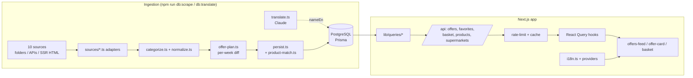

# Bonusfinder — Project Overview

A web app that scrapes Dutch supermarket **weekly deals** ("aanbiedingen"),
normalises them into one database, and shows them in a filterable, bilingual
(NL/EN) feed where you can compare prices across stores, save favourites, and
build a basket that gets split across supermarkets for the lowest total.

> Status: **ten live supermarkets** — **Hoogvliet, Albert Heijn, Jumbo, Aldi,
> Lidl, Dirk, DekaMarkt, Gall & Gall, PLUS, Vomar** — well over a thousand real
> offers per week. No fake/demo data. Deployed on Vercel + Supabase at
> **bonusfinder.nu**.

---

## Table of contents

1. [What it does](#what-it-does)
2. [Tech stack](#tech-stack)
3. [Features](#features)
4. [How it's built (architecture)](#how-its-built-architecture)
5. [Data model](#data-model)
6. [The scrapers in detail](#the-scrapers-in-detail)
7. [Categorisation & price normalisation](#categorisation--price-normalisation)
8. [The web app](#the-web-app)
9. [The basket optimiser](#the-basket-optimiser)
10. [Internationalisation (NL/EN) & theming](#internationalisation-nlen--theming)
11. [Performance & security](#performance--security)
12. [Directory structure](#directory-structure)
13. [Running it locally](#running-it-locally)
14. [Command & env reference](#command--env-reference)
15. [Known limitations](#known-limitations)

---

## What it does

Every supermarket publishes a weekly leaflet of discounts. This project:

1. **Scrapes** those deals from each supermarket's own public data source.
2. **Normalises** them — one `Product` + `Offer` shape, one category taxonomy,
   one discount rule — regardless of how each source structures its data.
3. **Serves** them through a Next.js app: a paginated feed, category filters,
   full-text search, sort options (newest / highest discount / lowest price /
   unit price), per-supermarket branding, favourites and a cross-store basket
   optimiser (per signed-in user), and a Dutch/English toggle with light/dark
   theming.

The end goal is price comparison: offers carry a `pricePerUnit` so the same
product across supermarkets can be ranked "beste deal", and a whole basket can be
split across stores to minimise the total.

---

## Tech stack

| Layer | Choice |
|---|---|
| Framework | **Next.js 15** (App Router, React 19, TypeScript) |
| Styling | **Tailwind CSS v4** + **shadcn/ui** components, light/dark themes |
| Database | **PostgreSQL** (Supabase) via **Prisma** |
| Data fetching | **TanStack Query** (React Query) |
| Auth | **Clerk** (favourites & basket are per-user) |
| Validation | **Zod** (shared query-param schemas) |
| Scraping | **cheerio** (HTML parse) + native `fetch` (no headless browser) |
| Translation | **@anthropic-ai/sdk** (Claude) |
| Search | Postgres full-text (`tsvector`, Dutch config) |
| Rate limiting | **Upstash Redis** (sliding window) + in-memory fallback |
| Hosting | **Vercel** + Supabase; GitHub for source |

---

## Features

- **Offer feed** — paginated grid of active deals, each card showing the
  supermarket logo, product name, price (with strikethrough original when
  present), discount badge or deal text, unit price, and validity date.
- **Category filter** — multi-select chips across 20 fine-grained categories
  (Groente, Fruit, Vlees, Vis, Zuivel, Eieren, Kaas, Dranken, **Alcohol**,
  Frisdrank, Pasta & rijst…).
- **Supermarket filter** — narrow the feed to one or more of the ten stores.
- **Full-text search** — search products by name/brand (Postgres `tsvector`,
  Dutch config) via `/api/products/search`.
- **Sorting** — newest, highest discount, lowest price, price per unit.
- **This week / Next week** — a timeframe toggle on the feed. "This week" shows
  currently-valid offers (default); "Next week" shows a source's upcoming ad once
  it's published (empty, with a friendly note, until then — never faked).
- **"Beste deal"** — the lowest `pricePerUnit` across a product's offers **within
  the selected timeframe** is flagged.
- **Favourites** — signed-in users save products; the favourites page shows the
  cheapest current offer per saved product.
- **Basket optimiser** — signed-in users add products to a basket; the app splits
  it across supermarkets to minimise the total spend and shows the per-store
  breakdown (see [The basket optimiser](#the-basket-optimiser)).
- **NL/EN language toggle** — the entire UI, deal text, dates, and (with a key)
  product names switch language; the choice persists.
- **Light / dark / system theme** — a header toggle that cycles the three modes,
  applied before first paint (no flash) and persisted.
- **Ten supermarkets** — each behind a thin adapter. Per-store discovery notes
  live in `src/scrapers/sources/<store>.discovery.md`.

---

## How it's built (architecture)

Two independent halves share one database: an **ingestion pipeline** (runs on
demand from the CLI) and a **web app** (reads the DB).



**Ingestion pipeline** (`src/scrapers/`):

- Each supermarket is a `Scraper` (`{ slug, name, scrape() → ScrapedOffer[] }`),
  registered in `SCRAPERS` in `run.ts`.
- `scrape()` fetches + parses the source into `ScrapedOffer` objects.
- `categorize()` and `normalize()` turn raw fields into the canonical shape.
- `offer-plan.ts` is a **pure, database-free planner**: it diffs a fresh scrape
  against what's in the DB, scoped per (ISO week of `validFrom`, product), so a
  re-scrape of one week never disturbs another. An early-published next-week ad
  coexists with the current week instead of overwriting it; offers already in the
  DB are updated in place, new ones inserted, and ones missing from the ad are
  kept until past `validUntil` (nothing is deleted by the planner).
- `product-match.ts` builds a normalised `productMatchKey` so the same product is
  recognised across stores (fuzzy match, not exact `(name, brand)`), powering
  cross-store comparison and the basket optimiser.
- `persist.ts` executes the plan in one transaction: upserts the supermarket,
  resolves/creates products, writes offers, and appends price history.

**Web app** (`src/app`, `src/components`, `src/hooks`, `src/lib`):

- `lib/queries/*` build the Prisma queries (feed filters/sort/pagination, "beste
  deal", basket optimisation, product search).
- Route handlers under `/api` wrap the queries, apply rate limiting, and a short
  in-process cache coalesces hot reads.
- React Query hooks (`use-offers`, `use-favorites`, `use-basket`,
  `use-supermarkets`) fetch and cache.
- Components render; language + theme contexts translate/theme at the edge.

---

## Data model

Prisma models (`prisma/schema.prisma`):

- **Supermarket** — `slug` ("ah", "hoogvliet", "dirk"…), `name`, `logoUrl`.
- **Product** — `name`, `nameEn?` (English translation), `brand?`, `imageUrl?`,
  `url?` (deep link), `category` (enum), `subcategory?`, `contentAmount?` +
  `contentUnit?` (normalised pack size), and a `searchVector` (`tsvector`) for
  full-text search.
- **Offer** — `salePrice?`, `originalPrice?`, `discountPercent?`, `offerText?`
  (e.g. "1+1 gratis"), `pricePerUnit?` + `pricePerUnitOf?`, `validFrom`,
  `validUntil`. Belongs to a Product + Supermarket.
  - `salePrice`/`discountPercent` are **nullable** because some promotions
    ("25% korting", "1+1 gratis") have no single euro price.
- **PriceHistory** — a price point per (product, supermarket, day); powers a
  price chart and lets you see whether a "deal" is actually cheap.
- **User** / **Favorite** — Clerk user id ↔ saved products (compound-unique).
- **BasketItem** — Clerk user id ↔ product + `quantity`, the persisted basket the
  optimiser splits across stores.

**Category enum** (20 values):

```
GROENTE  FRUIT  VLEES  VIS  ZUIVEL  EIEREN  KAAS  BROOD_BANKET
DRANKEN  ALCOHOL  SODA  PASTA_RIJST  SNACKS_SNOEP  DIEPVRIES
HOUDBAAR  ONTBIJT  DROGISTERIJ  HUISHOUDEN  BABY_KIND  HUISDIER
```

`ALCOHOL` is split out of `DRANKEN` (bier, wijn, sterke drank) so slijterij deals
— chiefly Gall & Gall — get their own chip and don't dilute the soft-drinks feed.

**Full-text search** (`prisma/fts_setup.sql`): `searchVector` is a plain
`tsvector` column kept up to date by a Postgres trigger (weight: name > brand >
subcategory) with a GIN index. Run `npm run db:fts` after each `prisma migrate`.

---

## The scrapers in detail

All sources are **unofficial but public** and touched gently (sequential, short
delays, realistic user-agent). Every scraper is plain `fetch` + `cheerio` /
JSON — **no headless browser** — and parsing lives in pure, testable helpers
(each source has a `*.test.ts` and a `*.discovery.md`). The one exception is
Vomar's optional Tier-3 step, which sends folder page images to the Anthropic API
(the same one `translate.ts` uses) — an extraction call, not a scraping browser.

| Store | Source & technique |
|---|---|
| **Hoogvliet** | Digital **folder** (Publitas): folder ids → per-spread `hotspots_data.json` → `/aanbiedingen/<id>` product pages parsed with cheerio. Takes the two newest folders so an early next-week folder is caught. |
| **Albert Heijn** | Public mobile **Bonus API**: anonymous bearer token → `bonuspage` metadata + section endpoints. Requires header `x-application: AHWEBSHOP`. Promotion-centric (nullable `salePrice`); next period gated behind `nextPeriodVisibleFrom` (a Friday). |
| **Jumbo** | Weekly ad inlined in page HTML as `__NUXT_DATA__` (devalue-encoded); parsed directly, no API. |
| **Aldi** | Weekly ad inlined as Next.js `apiData` in the page payload. |
| **Lidl** | Weekly ad inlined as `data-grid-data` on the page. |
| **Dirk** | SSR HTML product cards (`/aanbiedingen` + `/kanskoopjes`) parsed with cheerio. Gotcha: `price-large` is **cents** unless it carries a `hasEuros` class; weekend (Fri–Sun) validity. |
| **DekaMarkt** | SSR `product__card` HTML parsed with cheerio; `.prices__offer` shows a per-unit price even for 1+1 deals, so normalisation suppresses it. |
| **Gall & Gall** | Salesforce Commerce (`data-product` JSON) on `/acties/<cat>/` pages; all `ALCOHOL`/`DRANKEN`; multi-week stable `validFrom` to avoid duplicate rows. |
| **PLUS** | Webshop **promotions API** (OutSystems DataAction, AH-style internal JSON endpoint). Bootstraps the session cookie, moduleVersion, apiVersion and CSRF (from the `nr2Users` cookie), then one POST returns every category's offers. National store (`StoreNumber 0`); Wed–Tue validity; next week via `PromotionPeriodId 2`. |
| **Vomar** | Publitas **folder**, image-first (no hotspots/API). Tiered reader (`publitas.ts` + `vomar.ts`): Tier 1 hotspots (none today) → Tier 2 Publitas OCR text (keyless, precision-favoured) → **Tier 3 vision** (Anthropic SDK, the recommended path, gated behind `ANTHROPIC_API_KEY`). Weekly Wed rollover + a Thu–Sun weekend sub-folder; validity derived from the slug's ISO week. |

> **Vomar** was previously skipped as an image-only Publitas folder; it is now
> scraped by reading that folder (OCR text, then vision). See
> `sources/vomar.discovery.md` for the tier decision tree.

---

## Categorisation & price normalisation

**`categorize.ts`** — ordered Dutch keyword rules; the first match wins. Matching
is **word-start** (so "kip" matches "kipfilet" but "ei" does not match
"klein"). Fish is checked before meat, soda before generic drinks, **alcohol
before generic drinks**, etc. Some sources also carry a section label used as a
fallback (e.g. AH / DekaMarkt / Gall sections → `ALCOHOL`). Unmatched products
fall back to `HOUDBAAR`.

**`normalize.ts`** — one discount rule for every source:

- `discountPercent = round((original − sale) / original × 100)` when
  `original > sale`, otherwise `null`.
- **Multi-buy deals** ("1+1 gratis", "2e halve prijs", "N voor P") keep only
  `salePrice` + `offerText`; original/discount stay empty — a synthetic "50%"
  would mislead, since you must buy several to get it.

---

## The web app

- **`app/layout.tsx`** — root layout, Clerk provider, language + theme providers,
  the pre-paint theme script, header (brand + `HeaderNav` + `ThemeToggle`).
- **`app/page.tsx` → `OffersFeed`** — the main feed (search box, sort buttons,
  category + supermarket chips, timeframe toggle, grid, pagination, states).
- **`components/offers/offer-card.tsx`** — one deal card. Shows strikethrough
  original + `−X%` badge when present, else an `offerText` badge; product name
  links to the deep link. `supermarket-logo.tsx` renders the store badge.
- **`components/offers/favorite-button.tsx`** / **`basket-button.tsx`** — heart
  and add-to-basket toggles (open Clerk sign-in when signed out).
- **`app/favorites/page.tsx`** — saved products with their cheapest active offer.
- **`app/basket/page.tsx`** — the basket and its cross-store optimisation result.
- **`app/sign-in` / `app/sign-up`** — Clerk auth pages.
- **`lib/queries/offers.ts`** — the feed query: timeframe filter
  (`timeframeWhere` from `lib/queries/timeframe.ts` — `current` = started & not
  ended, `upcoming` = not yet started), optional supermarket/category/price/
  discount filters, sort (with `nulls: "last"`), pagination, and "beste deal"
  (min `pricePerUnit`, scoped to the timeframe).
- **`lib/validation/filters.ts`, `lib/validation/basket.ts`** — Zod schemas shared
  by route handlers and hooks, so query params & bodies are end-to-end type-safe.
- **`hooks/*`** — React Query wrappers (`use-offers`, `use-favorites`,
  `use-basket`, `use-supermarkets`).
- **`lib/db.ts`** — Prisma client singleton (avoids exhausting connections in dev).
- **SEO / PWA** — `manifest.ts`, `robots.ts`, `sitemap.ts`, `icon.svg`,
  `apple-icon.png`; canonical origin from `lib/config.ts` (`SITE_URL`).

The **category & supermarket filters are server-side**; the client just sends the
selected values.

---

## The basket optimiser

Signed-in users add products to a persisted **basket** (`BasketItem`). The
optimiser answers: *which supermarket should I buy each item from to spend the
least this week?*

- **`lib/queries/basket.ts`** — the **pure** `optimizeBasket()`: works entirely in
  integer **cents** (no floating-point euro drift), unit-tested without a database
  (`basket.test.ts`).
- **`lib/queries/basket-optimize.ts`** — the thin DB wrapper: loads the user's
  basket and the **currently valid** offers for those products (reusing the feed's
  exact current-timeframe predicate, not a re-implementation), converts Decimal
  euros to cents, and hands plain data to the pure optimiser.
- **`/api/basket`** (GET/mutations) and **`/api/basket/optimize`** (POST) — the
  route handlers; **`use-basket.ts`** is the hook. Basket lines carry **no
  pricing**; pricing comes only from the optimize endpoint, so the two never drift.

---

## Internationalisation (NL/EN) & theming

Two i18n layers, so the app is fully bilingual even without an API key:

1. **UI + deal text — client-side, free.** `lib/i18n.ts` has the NL/EN string
   dictionary + `t()`, locale-aware dates, and a **rule-based deal-text
   translator** ("1+1 gratis"→"1+1 free", "2 VOOR 4.99"→"2 for 4.99", "25%
   korting"→"25% off"). `components/language-provider.tsx` is the React context +
   `EN/NL` toggle, persisted to `localStorage`. Category labels are bilingual in
   `lib/categories.ts`.
2. **Product names — via Claude.** `Product.nameEn` is filled by
   `npm run db:translate` (`scrapers/translate.ts`). The UI shows `nameEn` in
   English mode and **falls back to the Dutch name when empty**, so nothing breaks
   if the translation step hasn't run.

**Theming** (`components/theme-provider.tsx`): light / dark / **system**, persisted
to `localStorage`, applied to `<html>` via a `.dark` class that drives every
design token in `globals.css`. A pre-paint script in `layout.tsx` sets the class
before first paint (no flash); `<ThemeToggle>` cycles the three modes.

---

## Performance & security

Hardening from a defensive security review and a production stress test:

- **Rate limiting** (`lib/rate-limit.ts`) — a sliding-window limiter on the public
  API and per-user mutations. Prefers **Upstash Redis** (shared across all Vercel
  isolates, so a single client is limited globally); falls back to a per-instance
  in-memory limiter when Upstash isn't configured. **Fail-open** — if the limiter
  throws, the request is let through.
- **Read cache** (`lib/cache.ts`) — a tiny in-process single-flight TTL cache:
  concurrent identical feed loads share one DB round-trip, and hot filter combos
  are served from memory for a short TTL. Layered under the CDN's `s-maxage`.
- **Security headers** (`next.config.ts`) — `X-Content-Type-Options`,
  `X-Frame-Options: DENY`, `Referrer-Policy`, HSTS, `Permissions-Policy` on every
  response. **No `images.remotePatterns`** on purpose, so `/_next/image` can't
  become an open proxy — product/logo images use plain `` with an `onError`
  fallback; brand assets are local unoptimized SVGs.
- **Scraped-URL sanitisation** — deep links from sources are validated before
  persistence.
- **No error leaks** — route handlers log detail server-side and return generic
  messages to the client.
- **Row-Level Security** — `prisma/rls_setup.sql` locks per-user tables at the DB.

---

## Directory structure

```
prisma/
  schema.prisma            # models + Category enum
  seed.ts                  # supermarket reference rows ONLY (non-destructive)
  fts_setup.sql            # full-text search trigger + index
  rls_setup.sql            # row-level security policies
  migrations/              # timestamped SQL migrations

src/
  app/
    api/{offers,favorites,basket,products,supermarkets}/…   # route handlers
    favorites/page.tsx  basket/page.tsx
    sign-in/  sign-up/
    layout.tsx  page.tsx  providers.tsx
    manifest.ts  robots.ts  sitemap.ts  icon.svg  apple-icon.png
  components/
    offers/{offer-card,offers-feed,favorite-button,basket-button,supermarket-logo}.tsx
    ui/{badge,card,input,skeleton}.tsx
    language-provider.tsx  theme-provider.tsx  header-nav.tsx
    logo-marquee-background.tsx
  hooks/{use-offers,use-favorites,use-basket,use-supermarkets}.ts
  lib/
    db.ts  categories.ts  i18n.ts  utils.ts  config.ts  auth.ts
    rate-limit.ts  cache.ts  supermarkets.ts
    queries/{offers,products,supermarkets,basket,basket-optimize,timeframe}.ts
    validation/{filters,basket}.ts
  middleware.ts            # Clerk
  scrapers/
    types.ts  categorize.ts  normalize.ts  offer-plan.ts  product-match.ts
    persist.ts  run.ts  translate.ts  translate-run.ts
    sources/{hoogvliet,albert-heijn,jumbo,aldi,lidl,dirk,dekamarkt,gall}.ts
    sources/*.discovery.md  sources/*.test.ts
```

---

## Running it locally

Prerequisites: Node 20+, a Postgres database (Supabase), a Clerk app.

```bash
# 1. Configure (see .env.example → .env)
#    DATABASE_URL, DIRECT_URL, Clerk keys, optional ANTHROPIC_API_KEY,
#    optional UPSTASH_REDIS_REST_URL / UPSTASH_REDIS_REST_TOKEN

npm install

# 2. Database
npx prisma migrate deploy      # apply all migrations
npm run db:fts                 # build full-text search
npm run db:seed                # supermarket reference rows

# 3. Ingest real offers
npm run db:scrape              # all 10 stores (~several minutes)
npm run db:translate           # optional: English product names (needs ANTHROPIC_API_KEY)

# 4. Run
npm run dev                    # http://localhost:3000
```

---

## Command & env reference

**Scripts** (`package.json`):

| Command | What it does |
|---|---|
| `npm run dev` / `build` / `start` | Next.js dev / build / prod (`build` runs `prisma generate` first) |
| `npm run lint` | `next lint` |
| `npm run typecheck` | `tsc --noEmit` |
| `npm test` | run the unit tests (`tsx --test src/**/*.test.ts`) |
| `npm run db:migrate` | `prisma migrate dev` |
| `npm run db:fts` | apply `fts_setup.sql` (run after each migrate) |
| `npm run db:seed` | seed supermarket rows (non-destructive) |
| `npm run db:scrape [-- <slug>] [--dry]` | scrape offers into the DB |
| `npm run db:translate` | fill `Product.nameEn` via Claude |
| `npm run db:reset` | `prisma migrate reset` |
| `npm run db:studio` | Prisma Studio |

**Environment** (`.env`):

| Var | For |
|---|---|
| `DATABASE_URL` | Prisma (pooled) |
| `DIRECT_URL` | Prisma migrate (direct) |
| `NEXT_PUBLIC_CLERK_*`, `CLERK_SECRET_KEY` | Clerk auth |
| `NEXT_PUBLIC_SITE_URL` | canonical origin (sitemap/robots/metadata); defaults to `https://bonusfinder.nu` |
| `ANTHROPIC_API_KEY` | only for `db:translate` (optional) |
| `UPSTASH_REDIS_REST_URL`, `UPSTASH_REDIS_REST_TOKEN` | shared rate limiter (optional; falls back to in-memory) |

---

## Known limitations

- **Categorisation is best-effort** keyword matching — some products land in
  `HOUDBAAR` or the occasional wrong bucket. Add a keyword in `categorize.ts` to
  fix one.
- **Unofficial sources** — the scrapers rely on each store's own folder JSON, app
  API, or inlined page data; any of these can change if the sites change.
- **Weekly rollover** — offer counts dip briefly while a supermarket switches its
  ad over to the new week.
- **"Next week" coverage varies by source** — Hoogvliet publishes next week's
  folder a few days early, so it appears first; AH only from its Friday
  `nextPeriodVisibleFrom`; the others surface next week whenever their own source
  exposes it (empty until then — never faked). The scrape must run for the data to
  land, so "Next week" is empty until the first scrape that catches it.
- **Favourites & basket stay on current offers** — only the feed has the timeframe
  toggle; favourites and the basket optimiser use the `current` (active) predicate.
- **Manual ingestion** — `db:scrape` / `db:translate` run on demand. A scheduler
  (GitHub Actions / Vercel Cron) would keep data fresh automatically; not wired up
  yet.
- **DB throughput** — the stress test showed the `/api/offers` DB path ceilings
  around ~5 rps under a pooled single connection; the in-process cache and CDN
  `s-maxage` absorb most of that, and Vercel's edge is the real per-IP backstop.
