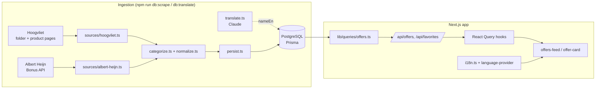

# Aanbiedingscraper — Project Overview

A web app that scrapes Dutch supermarket **weekly deals** ("aanbiedingen"),
normalises them into one database, and shows them in a filterable, bilingual
(NL/EN) feed where you can compare prices and save favourites.

> Status: five live supermarkets (**Hoogvliet**, **Albert Heijn**, **Jumbo**,
> **Aldi**, **Lidl**), ~532 real offers per week. No fake/demo data.

---

## Table of contents

1. [What it does](#what-it-does)
2. [Tech stack](#tech-stack)
3. [Features](#features)
4. [How it's built (architecture)](#how-its-built-architecture)
5. [Data model](#data-model)
6. [The scrapers in detail](#the-scrapers-in-detail)
7. [Categorisation & price normalisation](#categorisation--price-normalisation)
8. [The web app](#the-web-app)
9. [Internationalisation (NL/EN)](#internationalisation-nlen)
10. [Directory structure](#directory-structure)
11. [Running it locally](#running-it-locally)
12. [Command & env reference](#command--env-reference)
13. [Known limitations](#known-limitations)

---

## What it does

Every supermarket publishes a weekly leaflet of discounts. This project:

1. **Scrapes** those deals from each supermarket's own public data source.
2. **Normalises** them — one `Product` + `Offer` shape, one category taxonomy,
   one discount rule — regardless of how each source structures its data.
3. **Serves** them through a Next.js app: a paginated feed, category filters,
   sort options (newest / highest discount / lowest price / unit price),
   per-supermarket branding, favourites (per signed-in user), and a Dutch/English
   toggle.

The end goal is price comparison: offers carry a `pricePerUnit` so the same
product across supermarkets can be ranked "beste deal".

---

## Tech stack

| Layer | Choice |
|---|---|
| Framework | **Next.js 15** (App Router, React 19, TypeScript) |
| Styling | **Tailwind CSS v4** + **shadcn/ui** components |
| Database | **PostgreSQL** (Supabase) via **Prisma** |
| Data fetching | **TanStack Query** (React Query) |
| Auth | **Clerk** (favourites are per-user) |
| Validation | **Zod** (shared query-param schema) |
| Scraping | **cheerio** (HTML parse) + native `fetch` |
| Translation | **@anthropic-ai/sdk** (Claude) |
| Search | Postgres full-text (`tsvector`, Dutch config) |

---

## Features

- **Offer feed** — paginated grid of active deals, each card showing the
  supermarket, product name, price (with strikethrough original when present),
  discount badge or deal text, unit price, and validity date.
- **Category filter** — multi-select chips across 19 fine-grained categories
  (Groente, Fruit, Vlees, Vis, Zuivel, Eieren, Kaas, Pasta & rijst, Frisdrank…).
- **Sorting** — newest, highest discount, lowest price, price per unit.
- **"Beste deal"** — the lowest `pricePerUnit` across a product's active offers
  is flagged.
- **Favourites** — signed-in users save products; the favourites page shows the
  cheapest current offer per saved product.
- **NL/EN language toggle** — the entire UI, deal text, dates, and (with a key)
  product names switch language; the choice persists.
- **Five supermarkets** — Hoogvliet, Albert Heijn, Jumbo, Aldi and Lidl, each
  behind a thin adapter. Per-store discovery notes live in
  `src/scrapers/sources/<store>.discovery.md`.

---

## How it's built (architecture)

Two independent halves share one database: an **ingestion pipeline** (runs on
demand from the CLI) and a **web app** (reads the DB).



**Ingestion pipeline** (`src/scrapers/`):

- Each supermarket is a `Scraper` (`{ slug, name, scrape() → ScrapedOffer[] }`).
- `scrape()` fetches + parses the source into `ScrapedOffer` objects.
- `categorize()` and `normalize()` turn raw fields into the canonical shape.
- `persist()` writes everything in one transaction: it upserts the supermarket,
  resolves/creates products, **replaces the supermarket's active offers**
  (a weekly ad is a full snapshot, not a delta), and appends price history.

**Web app** (`src/app`, `src/components`, `src/hooks`, `src/lib`):

- `lib/queries/offers.ts` builds the Prisma query (filters, sort, pagination,
  "beste deal" computation).
- `/api/offers` and `/api/favorites` route handlers wrap the queries.
- React Query hooks (`use-offers`, `use-favorites`) fetch and cache.
- Components render; the language context translates at the edge.

---

## Data model

Prisma models (`prisma/schema.prisma`):

- **Supermarket** — `slug` ("ah", "hoogvliet"), `name`, `logoUrl`.
- **Product** — `name`, `nameEn?` (English translation), `brand?`, `imageUrl?`,
  `url?` (deep link), `category` (enum), `subcategory?`, `contentAmount?` +
  `contentUnit?` (normalised pack size), and a `searchVector` (`tsvector`) for
  full-text search.
- **Offer** — `salePrice?`, `originalPrice?`, `discountPercent?`, `offerText?`
  (e.g. "1+1 gratis"), `pricePerUnit?` + `pricePerUnitOf?`, `validFrom`,
  `validUntil`. Belongs to a Product + Supermarket.
  - `salePrice`/`discountPercent` are **nullable** because some promotions
    ("25% korting", "1+1 gratis") have no single euro price.
- **PriceHistory** — a price point per (product, supermarket, day); powers a
  price chart and lets you see whether a "deal" is actually cheap.
- **User** / **Favorite** — Clerk user id ↔ saved products (compound-unique).

**Category enum** (19 values):

```
GROENTE  FRUIT  VLEES  VIS  ZUIVEL  EIEREN  KAAS  BROOD_BANKET
DRANKEN  SODA  PASTA_RIJST  SNACKS_SNOEP  DIEPVRIES  HOUDBAAR
ONTBIJT  DROGISTERIJ  HUISHOUDEN  BABY_KIND  HUISDIER
```

**Full-text search** (`prisma/fts_setup.sql`): `searchVector` is a plain
`tsvector` column kept up to date by a Postgres trigger (weight: name > brand >
subcategory) with a GIN index. Run `npm run db:fts` after each `prisma migrate`.

---

## The scrapers in detail

Both sources are **unofficial but public** and touched gently (sequential,
short delays, realistic user-agent). Parsing lives in pure, testable helpers.

### Hoogvliet — the weekly folder (`sources/hoogvliet.ts`)

Hoogvliet's webshop endpoint returns an incomplete subset, so we scrape the
**digital folder** (the complete leaflet), which is a Publitas publication:

1. `www.hoogvliet.com/folder` → the current folder id (`folder_2026_<week>`).
2. Each spread's `hotspots_data.json` → the clickable deal links
   `/aanbiedingen/<articleId>` (~73 deals/week).
3. Fetch each `/aanbiedingen/<id>` product page → **cheerio** parses name,
   original + sale price, `offerText`, image, validity ("geldig van … t/m …"),
   and a clean deep link.

Plain `fetch` + cheerio, **no headless browser**, and it only hits ALLOWED paths
(`/aanbiedingen/<id>` + folder JSON), never the Disallowed `/INTERSHOP/`.

### Albert Heijn — the Bonus API (`sources/albert-heijn.ts`)

`ah.nl/bonus` renders from AH's public mobile app API:

1. `POST api.ah.nl/mobile-auth/v1/auth/token/anonymous` → anonymous bearer token.
2. `GET mobile-services/bonuspage/v3/metadata` → current period + ~28 category
   sections. **Requires header `x-application: AHWEBSHOP`** (else HTTP 500).
3. `GET bonuspage/v2/section?...&category=<X>` → `bonusGroup` deals (~118/week).

AH is **promotion-centric**: the discount is structured in `discountLabels`
(`price` for "voor X"/"N voor Y", `percentage` for "X% korting"). Deals like
"25% korting" or "1+1 gratis" have no absolute price — hence nullable
`salePrice`. Category comes from the product name, falling back to AH's own
section label when the name has no keyword.

---

## Categorisation & price normalisation

**`categorize.ts`** — ordered Dutch keyword rules; the first match wins. Matching
is **word-start** (so "kip" matches "kipfilet" but "ei" does not match
"klein"). Fish is checked before meat, soda before generic drinks, etc. Unmatched
products fall back to `HOUDBAAR`.

**`normalize.ts`** — one discount rule for every source:

- `discountPercent = round((original − sale) / original × 100)` when
  `original > sale`, otherwise `null`.
- **Multi-buy deals** ("1+1 gratis", "2e halve prijs", "N voor P") keep only
  `salePrice` + `offerText`; original/discount stay empty — a synthetic "50%"
  would mislead, since you must buy several to get it.

---

## The web app

- **`app/layout.tsx`** — root layout, Clerk provider, header (brand + `HeaderNav`).
- **`app/page.tsx` → `OffersFeed`** — the main feed (sort buttons, category
  chips, grid, pagination, empty/error states).
- **`components/offers/offer-card.tsx`** — one deal card. Shows strikethrough
  original + `−X%` badge when present, else an `offerText` badge; product name
  links to the deep link.
- **`components/offers/favorite-button.tsx`** — heart toggle (opens Clerk sign-in
  when signed out).
- **`app/favorites/page.tsx`** — saved products with their cheapest active offer.
- **`lib/queries/offers.ts`** — the Prisma query: active-offer filter, optional
  supermarket/category/price/discount filters, sort (with `nulls: "last"`),
  pagination, and the "beste deal" (min `pricePerUnit`) computation.
- **`lib/validation/filters.ts`** — Zod schema shared by the route handlers and
  hooks, so query params are end-to-end type-safe.
- **`hooks/use-offers.ts`, `hooks/use-favorites.ts`** — React Query wrappers.
- **`lib/db.ts`** — Prisma client singleton (avoids exhausting connections in dev).

The **category filter is server-side** (`product.category IN (...)`); the client
just sends the selected categories.

---

## Internationalisation (NL/EN)

Two layers, so the app is fully bilingual even without an API key:

1. **UI + deal text — client-side, free.** `lib/i18n.ts` has the NL/EN string
   dictionary + `t()`, locale-aware dates, and a **rule-based deal-text
   translator** ("1+1 gratis"→"1+1 free", "2 VOOR 4.99"→"2 for 4.99", "25%
   korting"→"25% off"). `components/language-provider.tsx` is the React context +
   `EN/NL` toggle, persisted to `localStorage`. Category labels are bilingual in
   `lib/categories.ts`.
2. **Product names — via Claude.** `Product.nameEn` is filled by
   `npm run db:translate` (`scrapers/translate.ts`, model `claude-opus-5`). The UI
   shows `nameEn` in English mode and **falls back to the Dutch name when empty**,
   so nothing breaks if the translation step hasn't run.

---

## Directory structure

```
prisma/
  schema.prisma            # models + Category enum
  seed.ts                  # supermarket reference rows ONLY (non-destructive)
  fts_setup.sql            # full-text search trigger + index
  migrations/              # timestamped SQL migrations

src/
  app/
    api/{offers,favorites,products}/…   # route handlers
    favorites/page.tsx
    layout.tsx  page.tsx  providers.tsx
  components/
    offers/{offer-card,offers-feed,favorite-button}.tsx
    ui/{badge,card,skeleton}.tsx
    language-provider.tsx  header-nav.tsx
  hooks/{use-offers,use-favorites}.ts
  lib/
    db.ts  categories.ts  i18n.ts  utils.ts
    queries/{offers,products}.ts
    validation/filters.ts
  middleware.ts            # Clerk
  scrapers/
    types.ts  categorize.ts  normalize.ts  persist.ts  run.ts
    translate.ts  translate-run.ts
    sources/{hoogvliet,albert-heijn}.ts
```

---

## Running it locally

Prerequisites: Node 20+, a Postgres database (Supabase), a Clerk app.

```bash
# 1. Configure (see .env.example → .env)
#    DATABASE_URL, DIRECT_URL, Clerk keys, optional ANTHROPIC_API_KEY

npm install

# 2. Database
npx prisma migrate deploy      # apply all migrations
npm run db:fts                 # build full-text search
npm run db:seed                # supermarket reference rows

# 3. Ingest real offers
npm run db:scrape              # Hoogvliet + Albert Heijn (~3–4 min)
npm run db:translate           # optional: English product names (needs ANTHROPIC_API_KEY)

# 4. Run
npm run dev                    # http://localhost:3000
```

---

## Command & env reference

**Scripts** (`package.json`):

| Command | What it does |
|---|---|
| `npm run dev` / `build` / `start` | Next.js dev / build / prod |
| `npm run db:migrate` | `prisma migrate dev` |
| `npm run db:fts` | apply `fts_setup.sql` (run after each migrate) |
| `npm run db:seed` | seed supermarket rows (non-destructive) |
| `npm run db:scrape [-- <slug>] [--dry]` | scrape offers into the DB |
| `npm run db:translate` | fill `Product.nameEn` via Claude |
| `npm run db:studio` | Prisma Studio |

**Environment** (`.env`):

| Var | For |
|---|---|
| `DATABASE_URL` | Prisma (pooled) |
| `DIRECT_URL` | Prisma migrate (direct) |
| `NEXT_PUBLIC_CLERK_*`, `CLERK_SECRET_KEY` | Clerk auth |
| `ANTHROPIC_API_KEY` | only for `db:translate` (optional) |

---

## Known limitations

- **Categorisation is best-effort** keyword matching — some products land in
  `HOUDBAAR` or the occasional wrong bucket. Add a keyword in `categorize.ts` to
  fix one.
- **Unofficial sources** — the scrapers rely on Hoogvliet's folder JSON and AH's
  app API; both can change if the sites change.
- **Weekly rollover** — offer counts dip briefly while a supermarket switches its
  ad over to the new week.
- **Manual ingestion** — `db:scrape` / `db:translate` run on demand. A scheduler
  (cron / GitHub Actions / Vercel Cron) would keep data fresh automatically; not
  set up yet.
- The `@anthropic-ai/sdk` version installed predates typed structured outputs, so
  `translate.ts` uses plain JSON prompting + validation.
